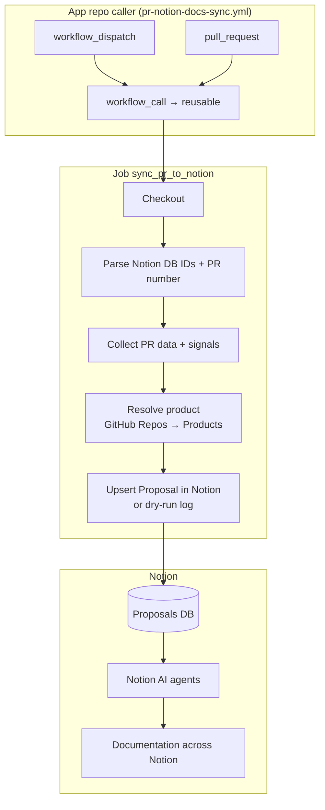

# PR Notion Docs Sync

This document describes the [PR Notion Docs Sync workflow](workflows/pr-notion-docs-sync.yml): what it sends to Notion, how callers use it, and how that feeds Notion AI agents and the **[Feature Overview — Example](https://www.notion.so/veamstudios/Feature-Overview-Example-8d715f443b534a4d915529aae41ee5a8)** output shape.

**Division of labor**

| Layer | Role |
|--------|------|
| **[Proposals database](https://www.notion.so/veamstudios/2ca691667ea34ddfabee572644ce8290?v=6a69b479eb1c477c96578aeb45c1eb6c&source=copy_link)** | **Only destination** for GitHub sync output (Proposal rows, keyed by **PR URL**). |
| **GitHub Actions** | Supplies **structured inputs** (properties + body, including **Signals for documentation agent**). Does **not** author final Feature Overview prose. |
| **Notion AI agents** | Watch Proposals and **produce / upsert** documentation (including Feature Overview–style pages). See [notion-feature-overview-agent-system-prompt.md](prompts/notion-feature-overview-agent-system-prompt.md), [notion-doc-proposal-agent-system-prompt.md](prompts/notion-doc-proposal-agent-system-prompt.md), [notion-doc-implementation-agent-system-prompt.md](prompts/notion-doc-implementation-agent-system-prompt.md). |

**Goal:** Few moving parts across repos: defaults live in the workflow; repos wire `NOTION_TOKEN` and pick a caller template.

---

## Design: keep it simple

| Principle | What we do |
|-----------|------------|
| **Constants in workflow** | Notion database URLs and `NOTION_VERSION` (currently `2026-03-11`, see [Notion versioning](https://developers.notion.com/reference/versioning)) live in the job `env` block in [`pr-notion-docs-sync.yml`](workflows/pr-notion-docs-sync.yml). Edit there to repoint workspaces; callers cannot override them. |
| **One secret** | Reusable runs need `secrets.notion-token` (callers map `NOTION_TOKEN` → `notion-token`). |
| **One row per repo in Notion** | Product is resolved from **GitHub Repos** by repository **Name**. |
| **Product from Notion only** | Product comes from **GitHub Repos** → **Products**; fix mapping in Notion if resolution fails. |
| **PR URL is the idempotency key** | Same PR updates the same Proposal page. |

### What each repo must do

1. Copy a workflow from [`caller-templates/`](../caller-templates/) (see below).
2. Configure **`NOTION_TOKEN`** (repo or org secret) for the Notion integration with access to the Proposals, GitHub Repos, and Products databases.
3. Ensure the repo exists in **GitHub Repos** with the correct **Products** tag, and that product exists in **Products**.

---

## Caller template

Copy [`caller-templates/pr-notion-docs-sync.yml`](../caller-templates/pr-notion-docs-sync.yml) into your app repo’s `.github/workflows/`. It:

- Runs on **`pull_request`** (`opened`, `synchronize`, `reopened`, `ready_for_review`), skipping **draft** PRs.
- Supports **`workflow_dispatch`** with PR number and optional **dry-run** (Actions → Run workflow).

It calls `VeamStudios/.github/.github/workflows/pr-notion-docs-sync.yml@main` with `notion-token` and passes `pr-number` / `dry-run` from the event or inputs.

### Secrets and env in other repos

| What | Where it lives | Notes |
|------|----------------|--------|
| **`NOTION_VERSION`, Notion database URLs** | Job `env` in [`workflows/pr-notion-docs-sync.yml`](workflows/pr-notion-docs-sync.yml) in **this** repo | Loaded from the **reusable** workflow definition at `@main`. App repos **do not** set these; changing them is a change to `VeamStudios/.github`. |
| **`secrets.notion-token`** | Passed **from** the app repo **into** the reusable workflow | The caller maps a repo/org secret: `notion-token: ${{ secrets.NOTION_TOKEN }}`. The app repo must define **`NOTION_TOKEN`** (or edit that line to match your secret name). |
| **`github.repository`, `github.token`, `github.event`** | **Caller's** context | The reusable job runs with the **triggering** repo’s identity and `GITHUB_TOKEN`, so `gh pr view` targets the correct PR. |
| **`permissions`** | Set on the job in the reusable workflow (`contents: read`, `pull-requests: read`) | Applies to the caller’s token; sufficient for `gh pr view` / diff on that repo. |

**Fork PRs:** For `pull_request` workflows, **repository secrets are not available** to runs triggered from **forks** (GitHub’s security model). PRs from forks will not receive `NOTION_TOKEN` unless you use a different pattern (e.g. `pull_request_target`, which has security tradeoffs). Internal branches and same-repo PRs behave as expected.

**Org-level secrets:** Work the same way if the caller repo is allowed to use them: keep `secrets.NOTION_TOKEN` pointing at an org secret visible to that repository.

---

## Triggers (reusable workflow)

This file is **`workflow_call` only**. It always runs in the **caller’s repository** (the app repo that invokes it), so `gh pr view` and GitHub Repos mapping match that app.

| Trigger | Behavior |
|--------|----------|
| `workflow_call` | Invoked from caller workflows. **Required secret:** `notion-token`. Optional inputs: `pr-number`, `dry-run`. |

**Manual runs** are not done from `VeamStudios/.github`: use **`workflow_dispatch`** on the [caller template](../caller-templates/pr-notion-docs-sync.yml) in **your app repo**.

Database URLs and Notion API version are **not** inputs; they are `env` on the job in the workflow file.

### Job and step names

The reusable workflow defines a single job, **`sync_pr_to_notion`**. Caller templates use the same job id so runs are easy to recognize across repos. Steps (in order): **Checkout repository** → **Parse Notion database IDs and resolve PR number** (`pr_and_db_ids`) → **Collect PR data and documentation signals** (`collect_pr`) → **Resolve product from Notion (GitHub Repos → Products)** (`resolve_product`) → **Upsert Proposal page in Notion Proposals database** or **Print dry-run summary (no Notion write)**.

---

## End-to-end flow

---

## Payload contract (what CI guarantees)

### Proposals database properties

| Property | Content |
|----------|---------|
| **Proposal** | `PR #{n} - {title}` |
| **Status** | `Raw Data` on full body sync; preserved when not `Raw Data` (see below). |
| **PR URL** | Canonical PR link. |
| **Summary** | **Machine-oriented single line** (no new Notion property): `N files \| +add/-del \| labels: … \| areas: …`. Aggregate `+/-` come from GitHub when available; otherwise `?`. |
| **Product** | Relation from GitHub Repos → Products. |
| **Doc Areas** | From path heuristics; excludes `Other` and `CI/Config` in multi_select. |

### Page body (order)

1. **PR Context** — Link, product, family, SHA, scope line (area counts).
2. **PR Description** — Truncated PR body (same limits as before).
3. **Signals for documentation agent** — Intro paragraph plus: base/head refs, primary area heuristic, aggregate +/-, labels, capped commit subjects, capped sorted path list, **Diff stat** (truncated). This is **input material** for Notion agents, not Feature Overview copy.
4. **Agent task** / **Review checklist** — Boilerplate to-dos.

### Signals (no LLM in CI)

- Labels, refs, additions/deletions (when `gh` exposes them), commit subjects (capped), up to **200** unique paths with overflow note, **`gh pr diff --stat`** capped at 8k chars.
- Path **area** tags remain heuristic (iOS, Web, Backend, CI/Config, Docs, Other).

---

## Feature Overview template (agent output shape)

The **[Feature Overview — Example](https://www.notion.so/veamstudios/Feature-Overview-Example-8d715f443b534a4d915529aae41ee5a8)** is the **target document** Notion agents create or update—not something this workflow writes.

Mirror outline for repo-side reference (confirm headings in Notion if they differ):

1. Title — Feature name  
2. Summary  
3. Product / area  
4. User-facing impact  
5. How it works  
6. Configuration / prerequisites / flags  
7. Documentation and links  
8. Rollout, limitations, open questions  

---

## Workflow behavior (updates and status)

1. **Raw Data:** Body is **replaced** (children cleared, then rewritten) so repeated CI runs do not append duplicate blocks.
2. **Not Raw Data** (e.g. `Proposed`): Only **properties** are updated (title, Summary, PR URL, Product, Doc Areas); **Status** and **body** are left so agent/reviewer work is not wiped.

---

## Dry run

`dry-run: true` resolves product and prints a summary; **no Notion writes**.

---

## Risks and limitations

| Topic | Detail |
|--------|--------|
| **Area heuristics** | Double-counting possible; some stacks map to **Other**. |
| **First product** in GitHub Repos `multi_select` wins if several are set. |
| **Notion schema** | Property names are fixed in YAML; Notion renames require workflow updates. |
| **Rate limits** | Heavy PRs: many Notion block operations; Notion API limits apply. |

---

## Optional follow-ups

- Tighten caller with a **label gate** (see comments in [`caller-templates/pr-notion-docs-sync.yml`](../caller-templates/pr-notion-docs-sync.yml)).
- Add a dedicated Notion **property** for long signals if **Summary** + body prove too small (requires schema change).

---

*Update this file when the workflow YAML or Notion databases change.*
