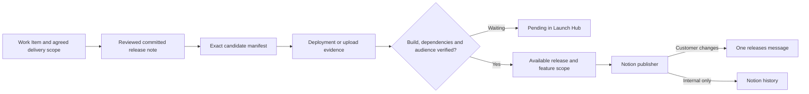

# Verified release ledger

Implementation Work Item: https://www.notion.so/3d4069083a038174982cc98d9c3b20cd
Launch Hub: https://www.notion.so/364069083a038004b927ef40124a0cd7

The ledger separates development, deployment and availability. The new paths default to **off**. Merge the shared actions first, then the worker and all callers with publication disabled. No production rollout or shadow validation is implied by these changes passing local tests.



## Authoring and review

Include a unique file in every PR, never reuse another PR's note filename:

```json
{
  "kind": "feature",
  "summary": "Export selected reports together.",
  "workItems": ["0123456789abcdef0123456789abcdef"],
  "scope": "bulk-report-export-v1",
  "targets": ["web"],
  "audience": "Enterprise administrators",
  "limitations": "Cloud projects only",
  "audienceGate": true,
  "requiredReleaseKeys": ["VeamStudios/SiteAuditPro-Backend/backend/release/v3.53.0"]
}
```

The PR body contains `Release note: .release-notes/bulk-export.json` and the existing `Work Items:` URL-only bullet list. Committed IDs and body links must match. `fix` and `internal` allow an empty Work Items list. `internal` releases stay in Notion. Backend/customer features use `feature`, with the customer outcome as their summary; service deployment detail uses `internal`.

Targets distinguish editions: `ios-consumer`, `ios-enterprise`, `android-consumer`, `android-enterprise`, `web`, `website`, `console`, `backend`, `cloudservices`. Product remains separate, so the same target can exist for SAP and CIP. Package versions are dependencies, never proof a consuming feature is released. A required package must be mapped to a verified consuming deployment before it can satisfy an availability component.

A current-head human PR approval freezes wording, classification, audience, limitations, target, scope, dependencies and WI links into the manifest. A missing review holds publication. The admin utility can explicitly approve an exact complete manifest with a review evidence link. Changing Notion's Changelog or Manifest afterward invalidates readiness; retries do not overwrite the edit. Corrections use a reviewed new event when the frozen manifest would change.

Use a **new scope ID for enhancements**. To plan delivery before a PR exists, create Feature Availability rows with their Work Item, target, scope, audience, limitations and explicit required release keys. Link all agreed targets through Work Items.Required Availability. The admin `approve-scope` operation snapshots the relation and its contracts; subsequent scope edits invalidate aggregate completion. One platform can be Available while the overall WI remains in development. The worker does not write developer status or implementation tabs.

## Exact contents and evidence

`record-release.yml` checks out the candidate commit with full history. It enumerates commits from the previous Available production baseline and retrieves PR associations directly, paging all results. It reads notes from the candidate and originating PR commit, compares their hashes and checks current-head approval. No merge-date, latest-default-head, mirrored-relation or PR-title heuristic establishes contents.

Ambiguous/cherry-picked provenance uses `mapping_path: .release-provenance/<identity>.json`, containing `baseline`, `reviewPr`, and `commits` (exact SHA → PR number). The mapping must itself be present in a merged, human-reviewed PR and unchanged at the candidate. A non-ancestor hotfix baseline requires this explicit mapping. An open hotfix PR is included only when its exact reviewed head is an ancestor of the shipped commit. Missing mappings remain Unverified.

Normal web/backend/CloudServices pipelines prepare before deployment. iOS consumer preparation uses the approved beta's exact commit/build. Website version allocation moves before deployment. Enterprise, manual Android and the legacy iOS hotfix flow currently snapshot after successful upload/distribution; see the remaining shadow qualification checks below. Their frozen notes still come from reviewed commits, not mutable Work Item text.

The manifest is saved in Notion and as a 90-day Actions artifact; Notion is the durable history. All WI IDs remain in the manifest even if the convenience relation exceeds Notion's 100-item request limit. Individual availability records use the complete manifest, not that relation. Very large single properties (>180,000 characters) fail explicitly rather than truncate.

The producer only records successful jobs. An optional repository variable `RELEASE_VERIFICATION_URL` supplies an HTTPS verification endpoint. Its successful response is paired with the successful deployment of the exact commit; an absent endpoint leaves availability waiting for verified manual evidence. Multi-service production depends on all four CloudServices jobs. No record failure reruns a deployment: retry the recording job only.

App Store monitoring reads pending ledger rows, resolves bundle/platform/version, reads the version's related build, and checks phased-release state. Enterprise is separate. A version match with a different build fails. Uploads wait, phased releases remain Limited rollout. Apple does not provide an exact release timestamp through these observations: the observation explicitly records `timeBasis: first-observed`; an operator can supply the actual timestamp. Do not interpret ASC createdDate as release time.

Android and managed distribution initially use the verified manual path. Specify the exact versionCode, evidence link, actual time and intended audience using `confirm-availability`. A selected "Live" value in the old marking workflow alone is insufficient. Remote Config booleans are only observations: use `audienceGate` for flags, entitlements and conditional audiences, then verify that audience explicitly. A later activation creates a separate event dependent on its deployed implementation.

## Ownership

| Fields | Sole writer after cutover |
|---|---|
| Work Item developer status and AI Implementation | Existing developer/Work Item Drift process; hosted configuration must be inspected before cutover |
| Work Item Required Availability and scope approval | Product owner, through reviewed scope/admin helper |
| Work Item Released | Release processor, only with `RELEASE_LIFECYCLE_WRITES=true` after ownership verification |
| Production Remote Config values | Existing production mirror; release-state input is disabled when org mode is live |
| Frozen manifest, source commit/build, deployment/store observations | Shared recorder and App Store reconciler |
| Availability/audience evidence and manual approvals | Explicit operator verification, bound to expected manifest hash |
| Release/Feature Availability state and Slack receipts | Notion release processor |
| GitHub mirror fields | Existing mirror workers, unchanged |

## Credentials and mode

The recorder needs existing Release Bot credentials (`BOT_RELEASE_APP_ID`, `BOT_RELEASE_PRIVATE_KEY`) plus `NOTION_TOKEN` shared with Releases. The bot needs read access to each caller and **contents write on VeamStudios/.github** for the shared lock. The worker GitHub credential needs equivalent central-lock access. A dedicated lock repository can replace `.github` in both implementations if narrower access is chosen before rollout.

The worker needs the datasets in `.env.example`, `RELEASE_SLACK_BOT_TOKEN`, `RELEASE_SLACK_CHANNEL_ID`, `RELEASE_OPERATIONS_CHANNEL_ID`, `RELEASE_CUTOVER_AT`, and explicit mode. Use a Slack bot with chat write and channel-history/metadata read access, already a member of both destination channels. Webhooks cannot update prior announcements or reconcile uncertain delivery.

| Mode | GitHub producer | Existing direct release notices | Worker publisher |
|---|---|---|---|
| off / unset | No-op | Continues | No-op |
| shadow | Records evidence | Continues | Computes states and Shadow readiness, no Slack |
| live | Records evidence | Disabled | Eligible records post/update automatically |

Publication and recording share an atomic GitHub ref lock (`refs/tags/veam-release-ledger-lock`). An annotated tag stores owner, nonce and acquisition time. A crash leaves the lock in place; there is deliberately no unsafe time-based takeover. Confirm no holder is active, reconcile any Sending receipts against Slack, then delete **only that exact lock ref**. Never delete software release tags.

The durable Sending marker precedes Slack. If Slack succeeds but receipt persistence fails, the next run searches all history pages for the stable key and saves the original timestamp. It never automatically retries an uncertain send with no matching message. An operator must verify absence before resetting Pending. Corrections use chat.update with the original timestamp. Per-release failures go to the operations channel with an independent durable receipt; a total Notion outage prevents that receipt too, so hosted worker-run failure monitoring must also be routed to operations before cutover.

## Coordinated rollout and remaining qualification

1. Merge shared actions, then all production callers and NotionWorkers, with mode off. Configure integration access and verify Console app access. Enable required release-note checks after all callers exist.
2. Inspect hosted Work Item Drift and Manager Product; agree ownership. Keep lifecycle writes false until verified. Resolve the current incomplete Enterprise evidence first.
3. Create historical baseline records with exact current production source/build and verification. Unsupported claims remain Unverified; historical announcements are always suppressed. Latest GitHub release metadata alone is not current audience availability.
4. Enable shadow across **all** callers and the worker. Exercise normal, Enterprise, store, manual Android, hotfix, activation, rollback, failed/partial deployment and retry paths. Validate exact platform identifiers and production checks. Confirm post-upload snapshot paths and phased-rollout policy meet the operational requirements before accepting them for cutover.
5. Compare frozen records and proposed posts with actual releases. Check no duplicate identities/receipts or stuck locks. Verify more-than-cap contents, multi-repo scopes, bug-fix-only releases, internal service suppression, dependency delays and wording invalidation.
6. At one cutover window, finish in-flight old notices, set the organisation GitHub mode live (all old release paths stop), then enable worker live with a common cutover timestamp. Historical and earlier releases stay suppressed. Do not start new production releases during the switch.
7. Roll back publication by setting the **worker** to shadow. Keep producers recording and org mode live, so old notifications do not restart. Evidence remains available for reconciliation.

The implementation is not qualified for production until these checks are recorded. No test Slack messages, production deployments or credential changes are part of local validation.

Primary API references: [Notion sync schedules](https://developers.notion.com/workers/guides/syncs), [App Store related build](https://developer.apple.com/documentation/appstoreconnectapi/get-v1-appstoreversions-_id_-build), [App Store phased release](https://developer.apple.com/documentation/appstoreconnectapi/get-v1-appstoreversions-_id_-appstoreversionphasedrelease), [Slack message updates](https://docs.slack.dev/reference/methods/chat.update/).
